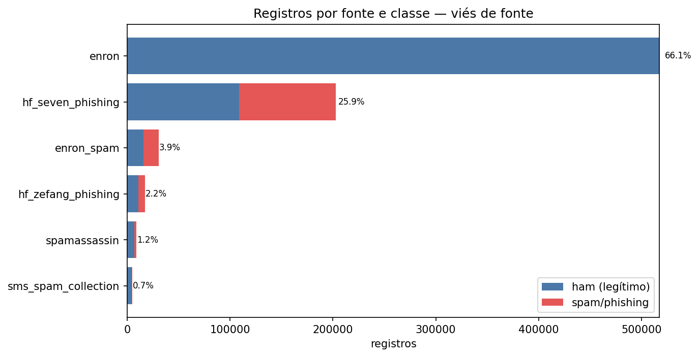
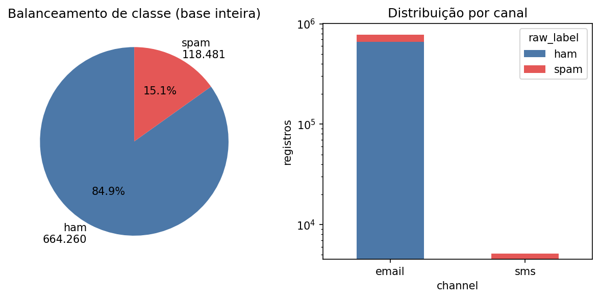
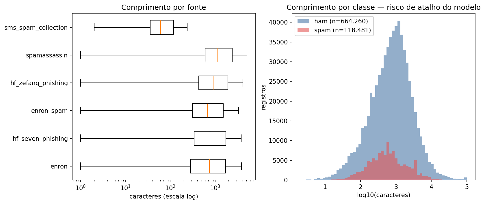
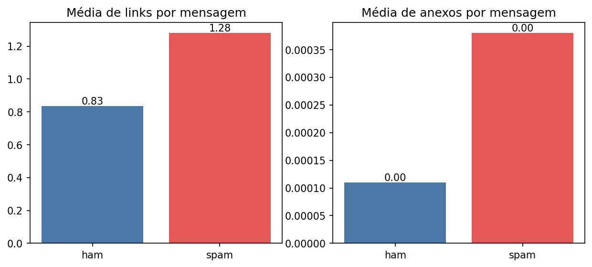
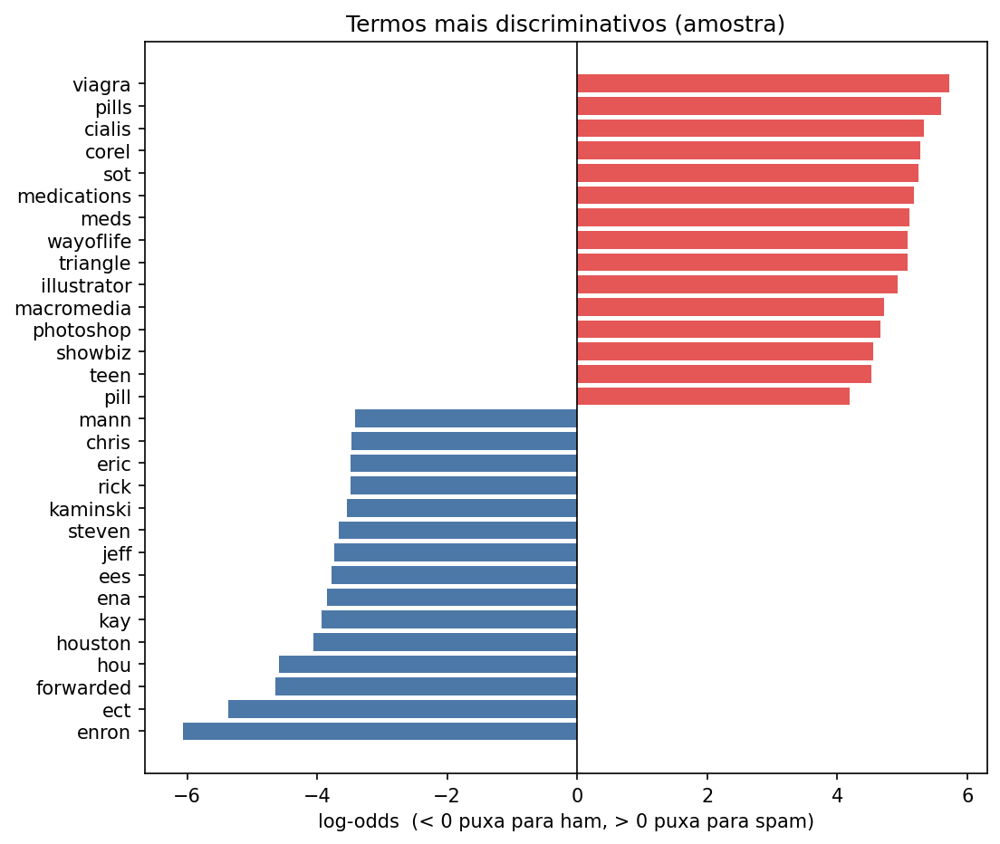

# Relatório de EDA — Corpus PhishGuard BR

> Gerado por `src/eda/run_eda.py` sobre `email_dataset_v1_parsed.parquet`.
> Ver planejamento_tg.md §5.2 (amostragem) e §10 (Fase 3).

## 1. Volume e viés de fonte

A base tem **782.741 registros** de 6 fontes.

| source              |    ham |   spam |   total |   %_da_base |   %_spam_na_fonte |
|:--------------------|-------:|-------:|--------:|------------:|------------------:|
| enron               | 517401 |      0 |  517401 |        66.1 |               0   |
| hf_seven_phishing   | 108688 |  94320 |  203008 |        25.9 |              46.5 |
| enron_spam          |  15910 |  14584 |   30494 |         3.9 |              47.8 |
| hf_zefang_phishing  |  10966 |   6536 |   17502 |         2.2 |              37.3 |
| spamassassin        |   6777 |   2388 |    9165 |         1.2 |              26.1 |
| sms_spam_collection |   4518 |    653 |    5171 |         0.7 |              12.6 |

**Achado.** A maior fonte responde por 66.1% da base. O Enron sozinho é 66.1% e não tem um único spam — um modelo treinado sobre a base integral pode aprender a reconhecer o estilo de correspondência corporativa da Enron em vez de aprender fraude.

## 2. Balanceamento de classe

- ham: **664.260** (84.9%)
- spam: **118.481** (15.1%)

**Achado.** Um classificador que responda sempre "legítimo" acerta 84.9% — por isso o projeto reporta F1, precisão e recall, nunca acurácia isolada.

## 3. Comprimento do texto

|                                 |      n |   mediana |   media |   p90 |
|:--------------------------------|-------:|----------:|--------:|------:|
| ('enron', 'ham')                | 517401 |       752 |    1795 |  3544 |
| ('enron_spam', 'ham')           |  15910 |       759 |    1593 |  3035 |
| ('enron_spam', 'spam')          |  14584 |       606 |    1276 |  3073 |
| ('hf_seven_phishing', 'ham')    | 108688 |      1026 |    2255 |  4108 |
| ('hf_seven_phishing', 'spam')   |  94320 |       552 |    1170 |  3121 |
| ('hf_zefang_phishing', 'ham')   |  10966 |      1011 |    3551 |  4106 |
| ('hf_zefang_phishing', 'spam')  |   6536 |       760 |    1696 |  3554 |
| ('sms_spam_collection', 'ham')  |   4518 |        53 |      71 |   143 |
| ('sms_spam_collection', 'spam') |    653 |       145 |     134 |   157 |
| ('spamassassin', 'ham')         |   6777 |       971 |    2769 |  4190 |
| ('spamassassin', 'spam')        |   2388 |      2250 |    4294 |  9701 |

**Achado.** A mediana varia de 53 a 2250 caracteres entre fontes. Sem estratificação, "texto curto" vira atalho para prever a classe majoritária daquela fonte.

## 4. Qualidade do parsing

- registros com erro de parsing: **0** (0.00%)
- registros com corpo vazio após parsing: **4** (0.00%)

## 5. Duplicatas remanescentes

A consolidação removeu duplicatas de texto **exato**. Normalizando (minúsculas + espaços colapsados) sobram **293.368 duplicatas** (37.5% da base), deixando 489.369 textos realmente distintos.

|                     |   registros |   duplicatas |   %_duplicado |   unicos |
|:--------------------|------------:|-------------:|--------------:|---------:|
| enron               |      517401 |       272972 |          52.8 |   244429 |
| hf_seven_phishing   |      203008 |         7017 |           3.5 |   195991 |
| enron_spam          |       30494 |          382 |           1.3 |    30112 |
| hf_zefang_phishing  |       17502 |         9763 |          55.8 |     7739 |
| spamassassin        |        9165 |         3208 |          35   |     5957 |
| sms_spam_collection |        5171 |           26 |           0.5 |     5145 |

_Leitura correta da tabela: a duplicata é atribuída à fonte lida **depois**, então `duplicatas` mistura repetição interna da fonte com sobreposição de fontes anteriores. A coluna `unicos` é o que importa — o texto novo que aquela fonte de fato acrescenta ao corpus._

**Decisão.** Deduplicar por texto normalizado antes do split, senão a mesma mensagem cai em treino e em teste e infla a métrica.

## 6. Idioma

Amostra de 8.000 registros:

| idioma | registros | % |
|---|---|---|
| en | 7.882 | 98.5% |
| ca | 15 | 0.2% |
| de | 15 | 0.2% |
| bn | 7 | 0.1% |
| fr | 7 | 0.1% |
| pl | 6 | 0.1% |
| es | 6 | 0.1% |
| nl | 5 | 0.1% |

**Achado.** 98.5% da amostra é `en`. Não há português no corpus público — é exatamente a lacuna que o corpus PT-BR deste TG vem preencher, e significa que hoje não existe conjunto de teste válido para o produto final.

## 7. Termos discriminativos

| termo       |   log_odds |   doc_spam |   doc_ham |
|:------------|-----------:|-----------:|----------:|
| viagra      |    5.71927 |         52 |         0 |
| pills       |    5.59913 |         46 |         0 |
| cialis      |    5.3325  |         35 |         0 |
| corel       |    5.27534 |         33 |         0 |
| sot         |    5.24549 |         32 |         0 |
| medications |    5.18297 |         30 |         0 |
| meds        |    5.11628 |         28 |         0 |
| triangle    |    5.08118 |         27 |         0 |
| wayoflife   |    5.08118 |         27 |         0 |
| illustrator |    4.92703 |         23 |         0 |
| macromedia  |    4.71939 |         38 |         1 |
| photoshop   |    4.66675 |         36 |         1 |
| showbiz     |    4.55234 |         32 |         1 |
| teen        |    4.52157 |         31 |         1 |
| pill        |    4.19133 |         22 |         1 |
| mann        |   -3.41581 |          0 |       174 |
| chris       |   -3.46596 |          1 |       367 |
| rick        |   -3.49277 |          0 |       188 |
| eric        |   -3.49277 |          0 |       188 |
| kaminski    |   -3.54432 |          0 |       198 |
| steven      |   -3.66712 |          0 |       224 |
| jeff        |   -3.74202 |          1 |       484 |
| ees         |   -3.77248 |          0 |       249 |
| ena         |   -3.84201 |          0 |       267 |
| kay         |   -3.9346  |          0 |       293 |
| houston     |   -4.05163 |          1 |       660 |
| hou         |   -4.59226 |          1 |      1134 |
| forwarded   |   -4.64878 |          1 |      1200 |
| ect         |   -5.37227 |          0 |      1237 |
| enron       |   -6.06056 |          0 |      2463 |

## 8. Decisões que este EDA fecha

1. **Amostrar o Enron**, não usá-lo integral — teto por fonte para nenhuma passar de ~25% da base de treino.
2. **Split estratificado** por fonte *e* por classe.
3. **Deduplicar por texto normalizado** antes de dividir treino/teste.
4. **Descartar** registros com corpo vazio.
5. **Métrica principal: F1** sobre a classe spam; acurácia só como contexto.
6. **Conjunto de teste final em PT-BR**, nunca visto em treino (§5.3).

## Figuras

